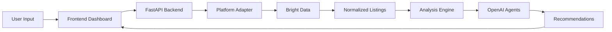
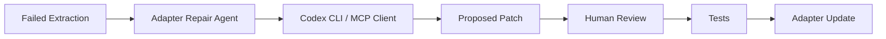

# ShopPilot


[](https://github.com/your-org/shop-pilot/actions)
[](LICENSE)

> **ShopPilot** is an AI-powered marketplace intelligence dashboard that helps online sellers optimize listings, compare competitors, understand pricing, discover trends, and plan product expansion across platforms.


---

## Problem

Online sellers compete across fragmented marketplaces with limited visibility into competitor pricing, keyword strategies, listing quality, and emerging trends. Manual research is slow, inconsistent, and doesn't scale across platforms.

## Features

- **Cross-platform analysis** — Etsy, Google Shopping, Generic URLs (with stubs for Amazon, eBay, Shopify, Shopee, TikTok Shop)
- **Etsy shop analysis** — Enter a shop name or URL; ShopPilot scrapes the catalog and discovers similar competitor shops via live marketplace search
- **Competitor intelligence** — Shop grouping, match scores, review counts, and positioning summaries from discovered search results
- **Pricing analysis** — Min/median/max, suggested ranges, under/overpriced detection
- **Keyword extraction** — Top keywords, common tags, missing opportunities (Etsy tags are parsed from listing URLs, not translated UI text)
- **Listing audits** — Title, description, tag, and pricing issues with actionable suggestions
- **Trend discovery** — Styles, materials, colors, and use-case patterns
- **AI recommendations** — OpenAI-powered listing and expansion advice (optional; requires `OPENAI_API_KEY`)
- **Free-form Q&A** — Ask questions about your market analysis (requires OpenAI)
- **Codex engineering agents** — Optional developer tools for adapter repair and test generation (disabled by default)
- **Live data only** — No mock or sample marketplace data. Analyses require Bright Data; scraping failures return clear errors instead of placeholders.

## Architecture





## Tech Stack

| Layer | Technologies |
|-------|-------------|
| Frontend | Next.js, TypeScript, Tailwind CSS, shadcn/ui, Recharts, Lucide |
| Backend | Python 3.11+, FastAPI, Pydantic, SQLAlchemy, SQLite, Alembic |
| Data | Bright Data SDK (`brightdata-sdk`) |
| AI | OpenAI Python SDK |
| Engineering | Codex CLI (optional), MCP-ready structure |
| CI | GitHub Actions, pytest |

## How It Works

1. User enters an Etsy shop name (primary flow), or a shop/product/marketplace URL, or niche keyword
2. User selects a platform and localization defaults (country, language, currency)
3. ShopPilot collects marketplace data via Bright Data (unlocker + crawler fallbacks for Etsy)
4. For Etsy shop analyses, competitor shops are discovered from live search queries generated from the user's catalog
5. Data is normalized into a shared product schema and saved in SQLite
6. The analysis engine computes pricing, keywords, competitors, listing issues, and trends
7. The dashboard displays insights with drill-down into individual listings and competitor shops
8. Click **Generate** on the AI Advisor to produce OpenAI recommendations grounded in the collected data
9. Developers can optionally enable Codex agents when marketplace extraction breaks

**Timing:** Etsy shop scrapes typically take 1–2 minutes and can take up to ~3 minutes for large shops or slow Bright Data responses. The frontend allows up to 3 minutes per analysis request.

## Supported Platforms

| Platform | Status |
|----------|--------|
| Etsy | ✅ Full adapter (shop, search, listing pages) |
| Google Shopping | ✅ Full adapter |
| Generic Marketplace | ✅ Full adapter |
| Amazon | 🔧 Stub + generic fallback |
| eBay | 🔧 Stub + generic fallback |
| Shopify | 🔧 Stub + generic fallback |
| Shopee | 🔧 Stub + generic fallback |
| TikTok Shop | 🔧 Stub + generic fallback |

## Quickstart

### Prerequisites

- Python 3.11+
- Node.js 20+
- **Bright Data API key** — required for any analysis (`BRIGHT_DATA_API_KEY` or `BRIGHTDATA_API_TOKEN`)
- **OpenAI API key** — optional; required only for AI recommendations and free-form Q&A

### Setup

```bash
# Clone and configure
cp .env.example .env
# Edit .env and add your Bright Data key (and OpenAI key if you want AI features)

# Install backend + frontend dependencies
make install

# Start both servers (recommended)
make dev
```

Open [http://127.0.0.1:3000](http://127.0.0.1:3000).

- Backend API: [http://127.0.0.1:8000](http://127.0.0.1:8000)
- Health check: [http://127.0.0.1:8000/health](http://127.0.0.1:8000/health)

### Run servers separately

```bash
# Terminal 1 — backend (listens on 0.0.0.0:8000)
make backend

# Terminal 2 — frontend (listens on 127.0.0.1:3000)
make frontend
```

### Stop / port conflicts

If you see `Address already in use` on port 8000 or 3000, a previous dev server is still running:

```bash
make stop    # frees ports 8000 and 3000
make dev     # start fresh
```

`make dev` also attempts to free stale processes on those ports before starting.

### Docker

```bash
docker compose up --build
```

Set `OPENAI_API_KEY` and `BRIGHT_DATA_API_KEY` in `.env` before starting. Analyses still require Bright Data inside Docker.

### First analysis

1. Open the dashboard and enter an Etsy shop name (e.g. `SanFranciscoStudio`)
2. Wait for scraping to complete (up to ~3 minutes)
3. Explore **Overview**, **Listings**, **Competitors**, **Pricing**, **Keywords**, and **Trends**
4. Visit **Settings** to confirm Bright Data and OpenAI integration status

If competitor discovery returns no shops, the analysis still succeeds with your shop's listings — live search simply did not surface similar shops for the generated queries.

## Environment Variables

| Variable | Required | Default | Description |
|----------|----------|---------|-------------|
| `BRIGHT_DATA_API_KEY` or `BRIGHTDATA_API_TOKEN` | **Yes** (for analyses) | — | Live marketplace scraping via Bright Data |
| `OPENAI_API_KEY` | No | — | AI recommendations and free-form Q&A |
| `DATABASE_URL` | No | `sqlite:///./shoppilot.db` | Database connection |
| `BACKEND_CORS_ORIGINS` | No | `http://localhost:3000,http://127.0.0.1:3000` | CORS origins |
| `SHOPPILOT_DEFAULT_COUNTRY` | No | `US` | Default country for new analyses |
| `SHOPPILOT_DEFAULT_LANGUAGE` | No | `en-US` | Default language |
| `SHOPPILOT_DEFAULT_CURRENCY` | No | `USD` | Default currency |
| `SHOPPILOT_DEFAULT_LOCALE` | No | `en_US` | Default locale string |
| `CODEX_AGENTS_ENABLED` | No | `false` | Enable Codex engineering agents |
| `CODEX_MODE` | No | `subprocess` | `subprocess` or `mcp` |
| `CODEX_ALLOW_FILE_PATCH` | No | `false` | Allow writing patch files |
| `CODEX_REQUIRE_HUMAN_REVIEW` | No | `true` | Require human review |
| `CODEX_TIMEOUT_SECONDS` | No | `120` | Codex subprocess timeout |

Frontend API URL (optional): set `NEXT_PUBLIC_API_URL` in `frontend/.env.local` if the backend is not at `http://localhost:8000`.

## Development

| Command | Description |
|---------|-------------|
| `make install` | Install backend (venv) and frontend (`npm install`) |
| `make dev` | Start backend + frontend together |
| `make stop` | Stop processes on ports 8000 and 3000 |
| `make backend` | Run FastAPI with hot reload |
| `make frontend` | Run Next.js dev server |
| `make test` | Run backend pytest + frontend typecheck |
| `make lint` | Backend compile check + frontend ESLint |

## Troubleshooting

| Symptom | Likely cause | What to do |
|---------|--------------|------------|
| `Address already in use` | Stale uvicorn/Next process | `make stop`, then `make dev` |
| `422` on `POST /api/analyses` | Bright Data scrape/parse failed | Check Settings → Bright Data configured; retry; Etsy may be slow or blocking |
| `Polling timeout after 45s` | Fast competitor search timed out | Shop scrape uses longer timeouts; empty competitors is OK if shop data loaded |
| Analysis times out in UI | Request exceeded 3 minutes | Retry; check Bright Data dashboard for unlocker errors |
| No competitors shown | Live search found no similar shops | Re-run analysis; competitors are never fabricated |
| AI Generate disabled | No OpenAI key | Add `OPENAI_API_KEY` to `.env` and restart backend |
| Old analyses show odd tags/competitors | Stale SQLite data from earlier runs | Run a new analysis after backend updates |

## API Overview

| Method | Endpoint | Description |
|--------|----------|-------------|
| GET | `/health` | API health check |
| POST | `/api/analyses` | Start new analysis (requires Bright Data) |
| GET | `/api/analyses` | List previous analyses |
| GET | `/api/analyses/{id}` | Get full analysis |
| GET | `/api/analyses/{id}/listings` | Get listings |
| GET | `/api/analyses/{id}/competitors` | Get competitors |
| POST | `/api/analyses/{id}/recommendations` | Generate AI recommendations (requires OpenAI) |
| POST | `/api/search/freeform` | Ask free-form question (requires OpenAI) |
| GET | `/api/settings/status` | Integration and localization status |
| GET | `/api/codex/status` | Codex agent status |
| POST | `/api/codex/repair-adapter` | Run adapter repair |
| POST | `/api/codex/extraction-qa` | Run extraction QA |
| POST | `/api/codex/generate-tests` | Generate pytest tests |

Failed ingestion returns **422** with a descriptive error message (no mock fallback).

## Adding a New Marketplace Adapter

See [docs/adding-platforms.md](docs/adding-platforms.md) for step-by-step instructions.

## Codex Engineering Workflows

Codex agents are **developer tools only** — not part of the seller workflow.

```bash
# Enable in .env
CODEX_AGENTS_ENABLED=true
CODEX_MODE=subprocess
```

Visit `/codex` in the frontend for the developer panel. See [docs/codex-agents.md](docs/codex-agents.md).

## Roadmap

See [docs/roadmap.md](docs/roadmap.md).

## Contributing

1. Fork the repository
2. Create a feature branch
3. Add tests for new functionality
4. Submit a pull request

## License

[MIT](LICENSE)
