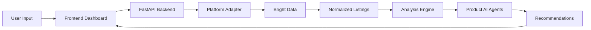
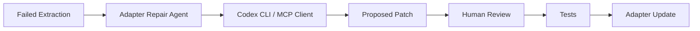

# ShopPilot


[](https://github.com/your-org/shop-pilot/actions)
[](LICENSE)

> **ShopPilot** is an AI-powered marketplace intelligence dashboard that helps online sellers optimize listings, compare competitors, understand pricing, discover trends, and plan product expansion across platforms.


---

## Problem

Online sellers compete across fragmented marketplaces with limited visibility into competitor pricing, keyword strategies, listing quality, and emerging trends. Manual research is slow, inconsistent, and doesn't scale across platforms.

## Features

- **Cross-platform analysis** — Etsy, Google Shopping, Generic URLs (with stubs for Amazon, eBay, Shopify, Shopee, TikTok Shop)
- **Competitor intelligence** — Shop grouping, review counts, positioning summaries
- **Pricing analysis** — Min/median/max, suggested ranges, under/overpriced detection
- **Keyword extraction** — Top keywords, common tags, missing opportunities
- **Listing audits** — Title, description, tag, and pricing issues with actionable suggestions
- **Trend discovery** — Styles, materials, colors, and use-case patterns
- **AI recommendations** — OpenAI-powered listing and expansion advice grounded in collected data
- **Free-form Q&A** — Ask questions about your market analysis
- **Codex engineering agents** — Optional developer tools for adapter repair and test generation
- **Mock fallback** — Fully functional without API keys for GitHub review

## Architecture





## Tech Stack

| Layer | Technologies |
|-------|-------------|
| Frontend | Next.js, TypeScript, Tailwind CSS, shadcn/ui, Recharts, Lucide |
| Backend | Python 3.11+, FastAPI, Pydantic, SQLAlchemy, SQLite, Alembic |
| Data | Bright Data SDK |
| AI | OpenAI Python SDK |
| Engineering | Codex CLI (optional), MCP-ready structure |
| CI | GitHub Actions, pytest |

## How It Works

1. User enters a shop URL, product URL, marketplace URL, or niche keyword
2. User selects a platform (Etsy, Google Shopping, etc.)
3. ShopPilot collects marketplace data via Bright Data (or mock fallback)
4. Data is normalized into a shared product schema
5. Analysis engine computes pricing, keywords, competitors, issues, and trends
6. Dashboard displays insights with drill-down into individual listings
7. AI agents provide recommendations for titles, tags, pricing, and expansion
8. Results are saved locally in SQLite for revisiting
9. Developers can optionally run Codex agents when extraction breaks

## Supported Platforms

| Platform | Status |
|----------|--------|
| Etsy | ✅ Full adapter |
| Google Shopping | ✅ Full adapter |
| Generic Marketplace | ✅ Full adapter |
| Amazon | 🔧 Stub + generic fallback |
| eBay | 🔧 Stub + generic fallback |
| Shopify | 🔧 Stub + generic fallback |
| Shopee | 🔧 Stub + generic fallback |
| TikTok Shop | 🔧 Stub + generic fallback |
| Mock | ✅ Always available fallback |

## Quickstart

### Prerequisites

- Python 3.11+
- Node.js 20+
- (Optional) Bright Data API key
- (Optional) OpenAI API key

### Setup

```bash
# Clone and configure
cp .env.example .env

# Install everything
make install

# Run backend (terminal 1)
make backend

# Run frontend (terminal 2)
make frontend
```

Open [http://localhost:3000](http://localhost:3000) — the app works immediately with mock data.

### Docker

```bash
docker compose up --build
```

## Environment Variables

| Variable | Required | Default | Description |
|----------|----------|---------|-------------|
| `OPENAI_API_KEY` | No | — | Enables live AI recommendations |
| `BRIGHT_DATA_API_KEY` | No | — | Enables live marketplace scraping |
| `DATABASE_URL` | No | `sqlite:///./shoppilot.db` | Database connection |
| `BACKEND_CORS_ORIGINS` | No | `http://localhost:3000` | CORS origins |
| `CODEX_AGENTS_ENABLED` | No | `false` | Enable Codex engineering agents |
| `CODEX_MODE` | No | `subprocess` | `subprocess` or `mcp` |
| `CODEX_ALLOW_FILE_PATCH` | No | `false` | Allow writing patch files |
| `CODEX_REQUIRE_HUMAN_REVIEW` | No | `true` | Require human review |
| `CODEX_TIMEOUT_SECONDS` | No | `120` | Codex subprocess timeout |

## API Overview

| Method | Endpoint | Description |
|--------|----------|-------------|
| GET | `/health` | API health check |
| POST | `/api/analyses` | Start new analysis |
| GET | `/api/analyses` | List previous analyses |
| GET | `/api/analyses/{id}` | Get full analysis |
| GET | `/api/analyses/{id}/listings` | Get listings |
| GET | `/api/analyses/{id}/competitors` | Get competitors |
| POST | `/api/analyses/{id}/recommendations` | Generate AI recommendations |
| POST | `/api/search/freeform` | Ask free-form question |
| GET | `/api/codex/status` | Codex agent status |
| POST | `/api/codex/repair-adapter` | Run adapter repair |
| POST | `/api/codex/extraction-qa` | Run extraction QA |
| POST | `/api/codex/generate-tests` | Generate pytest tests |

## Adding a New Marketplace Adapter

See [docs/adding-platforms.md](docs/adding-platforms.md) for step-by-step instructions.

## Codex Engineering Workflows

Codex agents are **developer tools only** — not part of the seller workflow.

```bash
# Enable in .env
CODEX_AGENTS_ENABLED=true
CODEX_MODE=subprocess
```

Visit `/codex` in the frontend for the developer panel. See [docs/codex-agents.md](docs/codex-agents.md).

## Roadmap

See [docs/roadmap.md](docs/roadmap.md).

## Contributing

1. Fork the repository
2. Create a feature branch
3. Add tests for new functionality
4. Submit a pull request

## License

[MIT](LICENSE)
